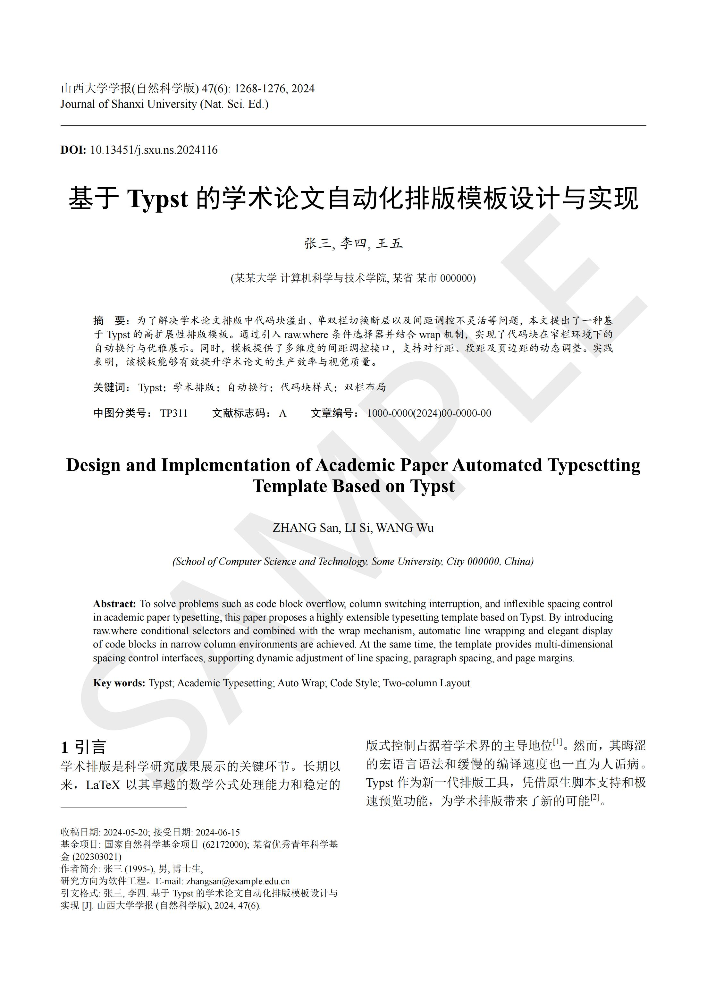
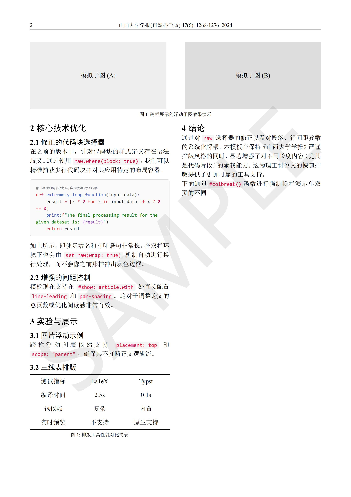

# Artical-Template

这是一个基于 Typst 编写的高扩展性学术论文自动化排版模板。该模板致力于复刻国内标准学术期刊（如《山西大学学报》等）的单双栏混排布局，并针对代码块溢出、图表浮动排版以及多维度间距调控进行了深度优化。

## 核心特性
- 开箱即用的开发环境：内置 VS Code 工作区配置，一键安装所有必需插件（包含完整的 Typst 编译环境），无需配置任何系统环境变量。
- 高度参数化的版式控制：支持通过简单的参数调用，全局动态调整分栏数（单栏/双栏）、行间距、段间距以及页边距。
- 优化的代码展示：重写了 raw 元素的渲染逻辑，完美解决窄栏（双栏）环境下长代码、长字符串溢出边界的问题，提供优雅的背景与等宽字体排版。
- 中英双语前置信息：原生支持中文与英文对照的文章标题、作者信息、机构摘要及关键词布局。
- 学术排版标准件：内置三线表样式支持、跨栏图表浮动（置顶/置底）支持，以及基于 gb-7714-2015-numeric 的国标参考文献排版。
## 快速开始 (环境配置)
本模板推荐使用 Visual Studio Code (VS Code) 进行编写与编译。得益于工作区配置，整个环境搭建过程接近零门槛。
- 下载并安装 VS Code：请前往官网下载并安装最新版的 Visual Studio Code。
- 获取本模板：下载或克隆本模板的所有文件到本地文件夹中。打开工作区：在 VS Code 中，点击左上角菜单栏的 文件 (File) -> 从文件打开工作区... (Open Workspace from File...)。
+ 选择本模板根目录下的`Artical-Template.code-workspace`文件并打开。
- 安装推荐插件：打开工作区后，VS Code 右下角会弹出提示框：“此工作区包含扩展推荐”。点击
-  安装 (Install)。这会自动为你安装由`Tinymist`驱动的 Typst 编译器以及相关公式计算、图片粘贴辅助插件。
- 开始使用：插件安装完成后，打开 `artical-template.typ` 文件，随意修改文字并按 Ctrl + S 保存，即可在侧边栏实时预览排版精美的 PDF 文件。
项目文件结构
- `Artical-Template.code-workspace`：VS Code 工作区环境配置文件（包含推荐插件列表与默认格式化行为）。
- `artical-template.typ`：模板的核心源码以及排版内容演示文件。包含了所有的函数定义与页面配置。
- `bibs/template.bib`：BibTeX 参考文献数据库文件，用于存储文章的引用条目。
- `README.md`：本说明文档。
## 样板文档预览



## 使用指南
全局信息配置在`artical-template.typ` 文件的中下部，你可以找到`#show: article.with(...)`函数调用。你需要在这里填入你的论文元数据：
```typst 
#import "artical-template.typ": artical
#show: article.with(
  title-cn: "基于 Typst 的学术论文自动化排版模板设计与实现",
  title-en: "Design and Implementation of Academic Paper Automated...",
  authors-cn: "张三, 李四, 王五",
  authors-en: "ZHANG San, LI Si, WANG Wu",
  affil-cn: "(某某大学 计算机科学与技术学院, 某省 某市 000000)",
  // ... 其他中英文摘要、关键词、期刊信息等
  
  // --- 版式调控选项 ---
  cols: 2,               // 控制正文分栏数，默认为 2 栏
  line-leading: 0.8em,   // 控制正文行间距
  par-spacing: 1.2em,    // 控制正文段间距
  page-margin: (top: 2.5cm, bottom: 2.5cm, left: 1.8cm, right: 1.8cm) // 页面边距
)
编写正文与代码块直接在 #show 配置块之后使用标准的 Typst 语法编写正文。如需插入多行代码，请使用三个反引号包围：
```
代码块示例：
````Typst
```python
def extremely_long_function(input_data):
    result = [x * 2 for x in input_data if x % 2 == 0]
    return result
```
````Typst
模板会自动为其添加灰色圆角背景、等宽字体，并在需要时自动换行。插入跨栏浮动图表如果在双栏排版中，图表过大需要跨越两栏展示，请在 #figure 中配置 placement 与 scope
````
跨页图表示例：
````Typst
#figure(
  // 你的图片或表格内容
  caption: [跨栏展示的浮动图表],
  placement: top,     // 置顶显示
  scope: "parent"     // 脱离当前单栏，跨越父级(页面)宽度
)
````
参考文献管理本模板采用国标 gb-7714-2015-numeric 格式。请将你的 BibTeX 文献条目添加到`bibs/template.bib`文件中。在正文中使用 @引用键值（例如`@typst2024`）进行引用。文档末尾会自动生成参考文献列表。

## 许可证
本项目遵循开源精神，具体协议请参考根目录下的 `LICENSE` 文件。
